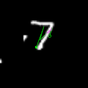
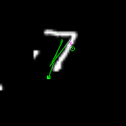

Tensorflow implementation of Recurrent Models of Visual Attention (Mnih et al. 2014), with additional research. Code based off of https://github.com/zhongwen/RAM.

<h1>Reproduced results</h1>

<h2>60 by 60 Translated MNIST</h2>
<table>
  <tr><th> Model                                    </th><th> Error  </th></tr>
  <tr><td> FC, 2 layers (64 hiddens each)           </td><td> 6.78%  </td></tr>
  <tr><td> FC, 2 layers (256 hiddens each)          </td><td> 2.65%  </td></tr>
  <tr><td> Convolutional, 2 layers                  </td><td> 1.57%  </td></tr>
  <tr><td> RAM, 4 glimpses, $12 \times 12$, 3 scale </td><td> 1.54%  </td></tr>
  <tr><td> RAM, 6 glimpses, $12 \times 12$, 3 scale </td><td> 1.08%  </td></tr>
  <tr><td> RAM, 8 glimpses, $12 \times 12$, 3 scale </td><td> 0.94%  </td></tr>
</table>

<h2> 60 by 60 Cluttered Translated MNIST </h2>
<table>
  <tr><th> Model                                     </th><th> Error  </th></tr>
  <tr><td> FC, 2 layers (64 hiddens each)            </td><td> 29.13% </td></tr>
  <tr><td> FC, 2 layers (256 hiddens each)           </td><td> 11.36% </td></tr>
  <tr><td> Convolutional, 2 layers                   </td><td> 8.37%  </td></tr>
  <tr><td> RAM, 4 glimpses, $12 \times 12$, 3 scale  </td><td> 5.15%  </td></tr>
  <tr><td> RAM, 6 glimpses, $12 \times 12$, 3 scale  </td><td> 3.33%  </td></tr>
  <tr><td> RAM, 8 glimpses, $12 \times 12$, 3 scale  </td><td> 2.63%  </td></tr>
</table>

<h2> 100 by 100$ Cluttered Translated MNIST </h2>
<table>
  <tr><th> Model                                     </th><th> Error  </th></tr>
  <tr><td> Convolutional, 2 layers                   </td><td> 16.22% </td></tr>
  <tr><td> RAM, 4 glimpses, $12 \times 12$, 3 scale  </td><td> 14.86% </td></tr>
  <tr><td> RAM, 6 glimpses, $12 \times 12$, 3 scale  </td><td> 8.3%   </td></tr>
  <tr><td> RAM, 8 glimpses, $12 \times 12$, 3 scale  </td><td> 5.9%   </td></tr>
</table>

<h2>60 by 60 Cluttered MNIST 6 glimpses examples </h2>
<table>
  <tr><th> Mean output                             </th><th> Sampled output                              </th></tr>
  <tr><td> </td><td>  </td></tr>
  <tr><td> </td><td>  </td></tr>
  <tr><td> </td><td>  </td></tr>
  <tr><td> </td><td>  </td></tr>
  <tr><td> </td><td>  </td></tr>

